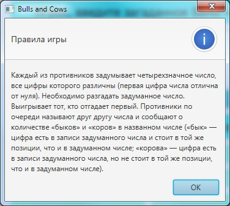
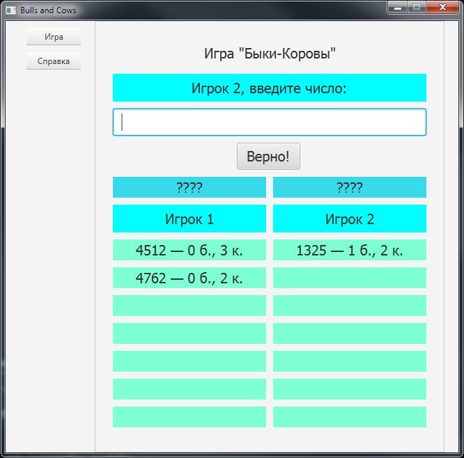
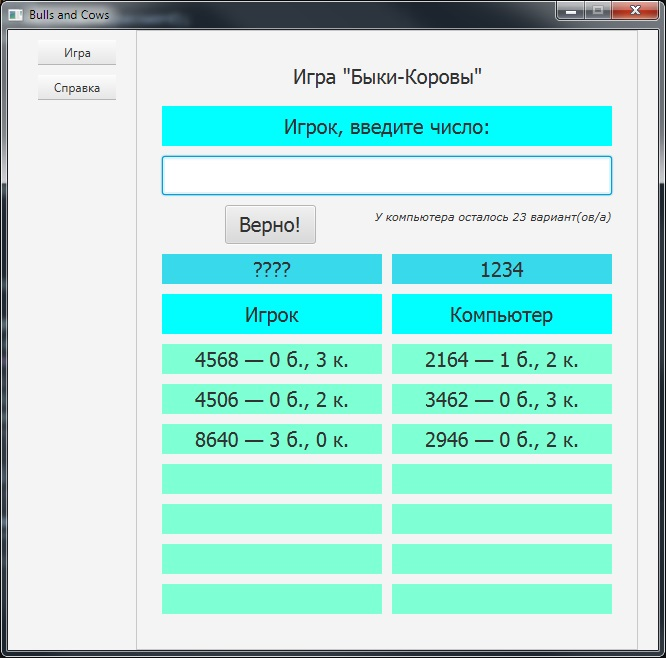

# Игра Быки-Коровы

Номер регистрации (свидетельства):
[2019665685](https://www1.fips.ru/registers-doc-view/fips_servlet?DB=EVM&rn=2824&DocNumber=2019665685&TypeFile=html)

---

### Название программы для ЭВМ:
Логическая игра «Быки и коровы»

### Реферат:
Программа реализует логическую игру «Быки и коровы». Пользователю предоставляется на выбор два варианта игры. Первый вариант - игра с противником, в качестве которого выступает компьютер, второй вариант - игра с другим человеком. Каждый из игроков загадывает четырехзначное число, цифры в котором не повторяются. Затем игроки пытаются отгадать число своего соперника. При каждом ходе игрока сообщается количество «быков» - количество угаданных цифр, находящихся на своей позиции, и количество «коров» - количество угаданных цифр, которые не совпадают со своими позициями. Игроки ходят по очереди. Побеждает тот, кто первым отгадает число, задуманное противником. Управление параметрами игры осуществляется через главное меню. Тип ЭВМ: IBM PC-совмест. ПК; ОС: Windows.

### Язык программирования: 
Java

### Объем программы для ЭВМ: 
261 Кб

---

## Интерфейс

### Правила игры

    

### Игра двух игроков

    

### Игра человека и компьютера

    

